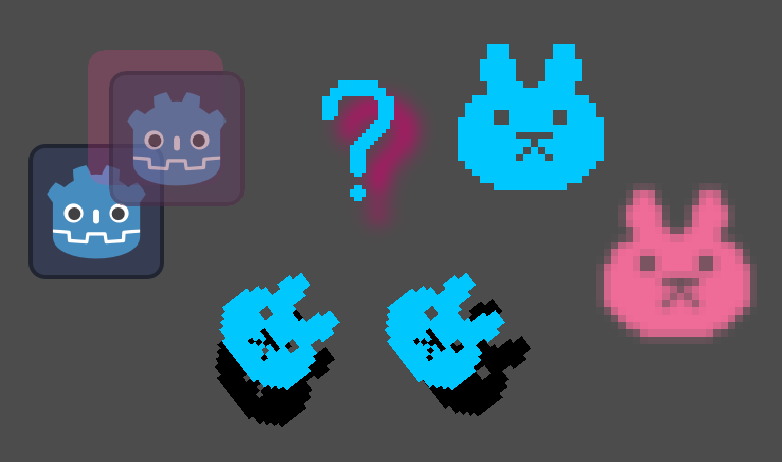

__Let's make it better:__  

#### __Rate__ 

# 2D shadows shader for Godot 4+

### Features:
- Any X/Y offset
- Any color
- debug helper
- no need to prepare an image
- 🆕 uses `modulate` from parent, including alpha for shadow
- 🆕 shadow blur. Blur goes out of shadow bounds
- 🆕 new option for handling parents' rotation

## Video (clickable)

## How to use
1) Add [shadow.gdshader](https://github.com/TABmk/godot-2d-shadow-shader/blob/master/shadow.gdshader) to your project
2) Under "Material" tab in your element, add a shader as a prepared material or create a new ShaderMaterial
3) Use "Shader Parameters" to configure your shadow

⚠️ For text nodes use built-in shadows at `theme_override_constants/shadow_outline_size`
